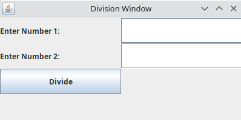

# First Thread and jConsole

In Java by default, a classic "public static void main(String[] args)" method uses a thread to be executed.

You can use the Thread class to manipulate the current thread.


The sleep method causes the currently executing thread to temporarily cease
execution according to the specified amount of time.

JDK includes a graphical tool for monitoring java local and remote machines that is called jConsole. You can view information about the running threads there. To access it open the terminal application and type the command “jconsole”.


jConsole first page:


Access jConsole while the FristThread project is running on Eclipse.


There is a tab to view information about threads.


Here you can see all current threads.


You can see our main thread.


# A simple divider using Threads

Create and run a divider calculator using Java Swing:
```
import javax.swing.*;
import java.awt.*;
import java.awt.event.ActionEvent;
import java.awt.event.ActionListener;

public class DivisionWindow {
    private JFrame frame;
    private JLabel num1Label, num2Label, resultLabel;
    private JTextField num1Field, num2Field;
    private JButton divideButton;

    public DivisionWindow() {
        frame = new JFrame("Division Window");
        frame.setSize(400, 200);
        frame.setDefaultCloseOperation(JFrame.EXIT_ON_CLOSE);
        Container container = frame.getContentPane();
        container.setLayout(new GridLayout(4, 2));
        num1Label = new JLabel("Enter Number 1: ");
        num1Field = new JTextField();
        num2Label = new JLabel("Enter Number 2: ");
        num2Field = new JTextField();
        resultLabel = new JLabel();
        divideButton = new JButton("Divide");
        divideButton.addActionListener(new ActionListener() {
            @Override
            public void actionPerformed(ActionEvent e) {
                int num1 = Integer.parseInt(num1Field.getText());
                int num2 = Integer.parseInt(num2Field.getText());
                int result = num1 / num2;
                resultLabel.setText("Result: " + result);
            }
        });
        container.add(num1Label);
        container.add(num1Field);
        container.add(num2Label);
        container.add(num2Field);
        container.add(divideButton);
        container.add(resultLabel);
        frame.setVisible(true);
    }
    public static void main(String[] args) {
        new DivisionWindow();
    }
}
```



This is a simple calculator that can only divide two numbers. We can increase its performance by delegating each division that is made to a new thread. Create a Thread object, pass the dividing function in its constructor and then call the start() function. 

```
import javax.swing.*;
import java.awt.*;
import java.awt.event.ActionEvent;
import java.awt.event.ActionListener;

public class DivisionWindow {
    private JFrame frame;
    private JLabel num1Label, num2Label, resultLabel;
    private JTextField num1Field, num2Field;
    private JButton divideButton;

    public DivisionWindow() {
        frame = new JFrame("Division Window");
        frame.setSize(400, 200);
        frame.setDefaultCloseOperation(JFrame.EXIT_ON_CLOSE);
        Container container = frame.getContentPane();
        container.setLayout(new GridLayout(4, 2));
        num1Label = new JLabel("Enter Number 1: ");
        num1Field = new JTextField();
        num2Label = new JLabel("Enter Number 2: ");
        num2Field = new JTextField();
        resultLabel = new JLabel();
        divideButton = new JButton("Divide");
        divideButton.addActionListener(new ActionListener() {
            @Override
            public void actionPerformed(ActionEvent e) {
                Thread divideThread = new Thread(() -> {
                    int num1 = Integer.parseInt(num1Field.getText());
                    int num2 = Integer.parseInt(num2Field.getText());
                    int result = num1 / num2;
                    resultLabel.setText("Result: " + result);
                });
                divideThread.start();
            }
        });
        container.add(num1Label);
        container.add(num1Field);
        container.add(num2Label);
        container.add(num2Field);
        container.add(divideButton);
        container.add(resultLabel);
        frame.setVisible(true);
    }
    public static void main(String[] args) {
        new DivisionWindow();
    }
}
```
# Using more than one Thread at once

The code below creates two methods and then executes both using one thread each.

```
public class Market {

	public void justLooking(String name) {
		System.out.println(name + " has arrived");
			System.out.println(name + " is enterig market");
			System.out.println(name + " is going through shopping carts without picking one up");
			System.out.println(name + " is walking around");
			threadSleep(10000);
			System.out.println(name + " is checking prices");
			System.out.println(name + " is leaving");
	}

	public void buying(String name) {
		System.out.println(name + " has arrived");
			System.out.println(name + " is enterig market");
			System.out.println(name + " is picking up a shopping cart");
			System.out.println(name + " is walking around");
			System.out.println(name + " is checking prices");
			threadSleep(30000);
			System.out.println(name + " is picking up things to buy");
			System.out.println(name + " is paying");
			System.out.println(name + " is leaving");
	}
	
	private void threadSleep(int time) {
		try {
			Thread.sleep(time);
		} catch (InterruptedException e) {
			// TODO Auto-generated catch block
			e.printStackTrace();
		}
	}

	public static void main(String[] args) {
		Market market = new Market();
		Thread client1Thread = new Thread(() -> {
			String name = Thread.currentThread().getName();
			market.justLooking(name);
		}, "Sandra");

		Thread client2Thread = new Thread(() -> {
			String name = Thread.currentThread().getName();
			market.buying(name);
		}, "Paulo");
		client1Thread.start();
		client2Thread.start();
	}
}
```
The console output should be like this:
```
Sandra has arrived
Sandra is enterig market
Paulo has arrived
Paulo is enterig market
Sandra is going through shopping carts without picking one up
Paulo is picking up a shopping cart
Paulo is walking around
Sandra is walking around
Paulo is checking prices
Sandra is checking prices
Sandra is leaving
Paulo is picking up things to buy
Paulo is paying
Paulo is leaving

```

```

public class Market {

	public void justLooking(String name) {
		System.out.println(name + " has arrived");
		synchronized (this) {
			System.out.println(name + " is enterig market");
			System.out.println(name + " is going through shopping carts without picking one up");
			System.out.println(name + " is walking around");
			threadSleep(10000);
			System.out.println(name + " is checking prices");
			System.out.println(name + " is leaving");
		}
	}

	public void buying(String name) {
		System.out.println(name + " has arrived");
		synchronized (this) {
			System.out.println(name + " is enterig market");
			System.out.println(name + " is picking up a shopping cart");
			System.out.println(name + " is walking around");
			System.out.println(name + " is checking prices");
			threadSleep(30000);
			System.out.println(name + " is picking up things to buy");
			System.out.println(name + " is paying");
			System.out.println(name + " is leaving");
		}
	}

	private void threadSleep(int time) {
		try {
			Thread.sleep(time);
		} catch (InterruptedException e) {
			// TODO Auto-generated catch block
			e.printStackTrace();
		}
	}

	public static void main(String[] args) {
		Market market = new Market();
		Thread client1Thread = new Thread(() -> {
			String name = Thread.currentThread().getName();
			market.justLooking(name);
		}, "Sandra");
		Thread client2Thread = new Thread(() -> {
			String name = Thread.currentThread().getName();
			market.buying(name);
		}, "Paulo");
		client1Thread.start();
		client2Thread.start();
	}
}
```
The console outcome:
```
Sandra has arrived
Sandra is enterig market
Paulo has arrived
Sandra is going through shopping carts without picking one up
Sandra is walking around
Sandra is checking prices
Sandra is leaving
Paulo is enterig market
Paulo is picking up a shopping cart
Paulo is walking around
Paulo is checking prices
Paulo is picking up things to buy
Paulo is paying
Paulo is leaving
```
Notice that apart from the phrase "Paulo has arrived", that was not synchronized, the rest of the second thread only runs when the execution of the first one ends.

# wait()

We can add forms of communication between threads. The wait() method is used to add a state verification (represented by the boolean tooCrowded) before the rest of the thread runs. 
```

public class Market {
	
	private boolean tooCrowded = true;

	public void justLooking(String name) {
		System.out.println(name + " has arrived");
		synchronized (this) {
			System.out.println(name + " is enterig market");
			if (tooCrowded) {
				waitOutside(name);
			}
			System.out.println(name + " is going through shopping carts without picking one up");
			System.out.println(name + " is walking around");
			threadSleep(10000);
			System.out.println(name + " is checking prices");
			System.out.println(name + " is leaving");
		}
	}

	public void buying(String name) {
		System.out.println(name + " has arrived");
		synchronized (this) {
			System.out.println(name + " is enterig market");
			if (tooCrowded) {
				waitOutside(name);
			}
			System.out.println(name + " is picking up a shopping cart");
			System.out.println(name + " is walking around");
			System.out.println(name + " is checking prices");
			threadSleep(30000);
			System.out.println(name + " is picking up things to buy");
			System.out.println(name + " is paying");
			System.out.println(name + " is leaving");
		}
	}

	private void threadSleep() {
		try {
			Thread.sleep(10000);
		} catch (InterruptedException e) {
			// TODO Auto-generated catch block
			e.printStackTrace();
		}
	}

	private void waitOutside(String name) {
		System.out.println("Oh no! The market is too crowded");
		System.out.println(name + " decides to return later");
		try {
			this.wait();
		} catch (InterruptedException e) {
			// TODO Auto-generated catch block
			e.printStackTrace();
		}
	}

	public static void main(String[] args) {
		Market market = new Market();
		Thread client1Thread = new Thread(() -> {
			String name = Thread.currentThread().getName();
			market.justLooking(name);
		}, "Sandra");
		Thread client2Thread = new Thread(() -> {
			String name = Thread.currentThread().getName();
			market.buying(name);
		}, "Paulo");
		client1Thread.start();
		client2Thread.start();
	}
}
```
Outout:
```
Sandra has arrived
Sandra is enterig market
Paulo has arrived
Oh no! The market is too crowded
Sandra decides to return later
Paulo is enterig market
Oh no! The market is too crowded
Paulo decides to return later
```
The code has reached the deadlock state. Both threads are waiting for a state change after the executed method (waitOutside()), but they keep receiving the same info from the boolean attribute (tooCrowded).

# notify()

A thread can notify another about a state change with the notify() method. 
```
public class Market {

	private int customersIn;

	private boolean tooCrowded = false;

	public void justLooking(String name) {
		System.out.println(name + " has arrived");
		synchronized (this) {
			checkCustomersNumber(name);
			System.out.println(name + " enters");
			System.out.println("There are " + customersIn + " inside the store");
			System.out.println(name + " is going through shopping carts without picking one up");
			System.out.println(name + " is walking around");
		}
		threadSleep(15000);
		System.out.println(name + " is checking prices");
		System.out.println(name + " is leaving");
	}

	public void buying(String name) {
		System.out.println(name + " has arrived");
		synchronized (this) {
			checkCustomersNumber(name);
			System.out.println(name + " enters");
			System.out.println("There are " + customersIn + " inside the store");
			System.out.println(name + " is picking up a shopping cart");
			System.out.println(name + " is walking around");
			System.out.println(name + " is checking prices");
		}
		threadSleep(30000);
		System.out.println(name + " is picking up things to buy");
		System.out.println(name + " is paying");
		System.out.println(name + " is leaving");
	}

	private void threadSleep(int time) {
		try {
			Thread.sleep(time);
		} catch (InterruptedException e) {
			// TODO Auto-generated catch block
			e.printStackTrace();
		}
	}

	private void checkCustomersNumber(String name) {
		customersIn = customersIn++ + 1;
		if (customersIn >= 3) {
			tooCrowded = true;
			waitOutside(name);
		}
		System.out.println(name + " is enterig market");
	}

	private void waitOutside(String name) {
		System.out.println(name + " is attempting to enter");
		System.out.println("Oh no! The market is too crowded");
		System.out.println(name + " decides to return later");
		try {
			this.wait();
		} catch (InterruptedException e) {
			// TODO Auto-generated catch block
			e.printStackTrace();
		}
	}

	public void extraCashier() {
		synchronized (this) {
			System.out.println("Too many custumers to buy");
			System.out.println("Management decides to allocate more employees as cashiers");
			if (!tooCrowded) {
				System.out.println("Market is not crowded");
				return;
			}
			threadSleep(10000);
			System.out.println("The number of customers gradually decreases");
			tooCrowded = false;
			customersIn = 1;
			this.notifyAll();
		}
	}

	public static void main(String[] args) {
		Market market = new Market();
		Thread client1Thread = new Thread(() -> {
			String name = Thread.currentThread().getName();
			market.justLooking(name);
		}, "Sandra");

		Thread client2Thread = new Thread(() -> {
			String name = Thread.currentThread().getName();
			market.buying(name);
		}, "Paulo");

		Thread client3Thread = new Thread(() -> {
			String name = Thread.currentThread().getName();
			market.buying(name);
		}, "Ana");

		Thread managementThread = new Thread(() -> {
			while (true) {
				market.threadSleep(30000);
				market.extraCashier();
			}
		}, "Management");

		client1Thread.start();
		client2Thread.start();
		client3Thread.start();
		managementThread.start();
	}
}
```
To decide if the market is crowded, a method and an attribute that counts how many customers are in the market were added to the code. If there are more than 3 clients at the market, it is decided to be crowded. As an outcome, there is a method representing the management allocating more employees to work at the market cashiers (extraCashiers()). In this method, the notifyAll() function was used to notify the other threads about the state change.

An additional thread (Management) was also added to periodically check if the market is crowded. Check the outcome:
```
Sandra has arrived
Paulo has arrived
Ana has arrived
Sandra is enterig market
Sandra enters
There are 1 inside the store
Sandra is going through shopping carts without picking one up
Sandra is walking around
Ana is enterig market
Ana enters
There are 2 inside the store
Ana is picking up a shopping cart
Ana is walking around
Ana is checking prices
Paulo is attempting to enter
Oh no! The market is too crowded
Paulo decides to return later
Sandra is checking prices
Sandra is leaving
Too many custumers to buy
Management decides to allocate more employees as cashiers
Ana is picking up things to buy
Ana is paying
Ana is leaving
The number of customers gradually decreases
Paulo is enterig market
Paulo enters
There are 1 inside the store
Paulo is picking up a shopping cart
Paulo is walking around
Paulo is checking prices
Too many custumers to buy
Management decides to allocate more employees as cashiers
Market is not crowded
Paulo is picking up things to buy
Paulo is paying
Paulo is leaving
Too many custumers to buy
Management decides to allocate more employees as cashiers
Market is not crowded
```