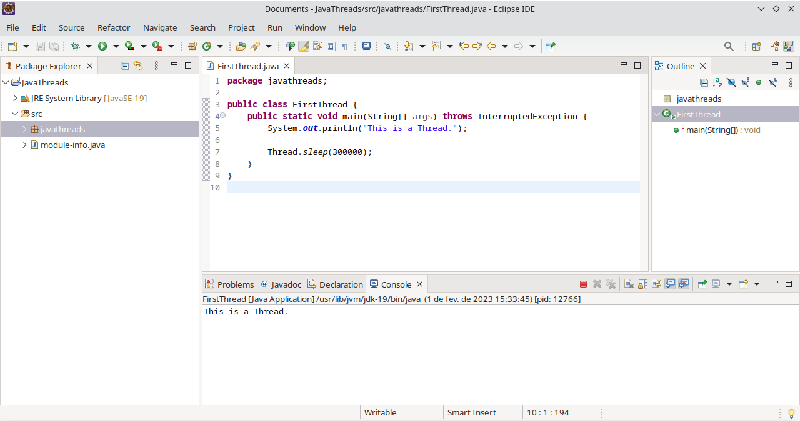
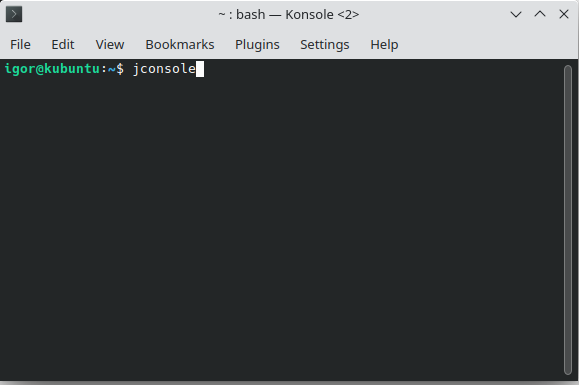
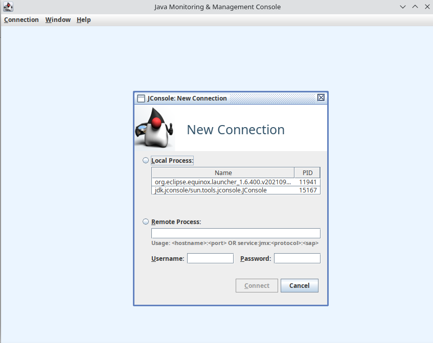
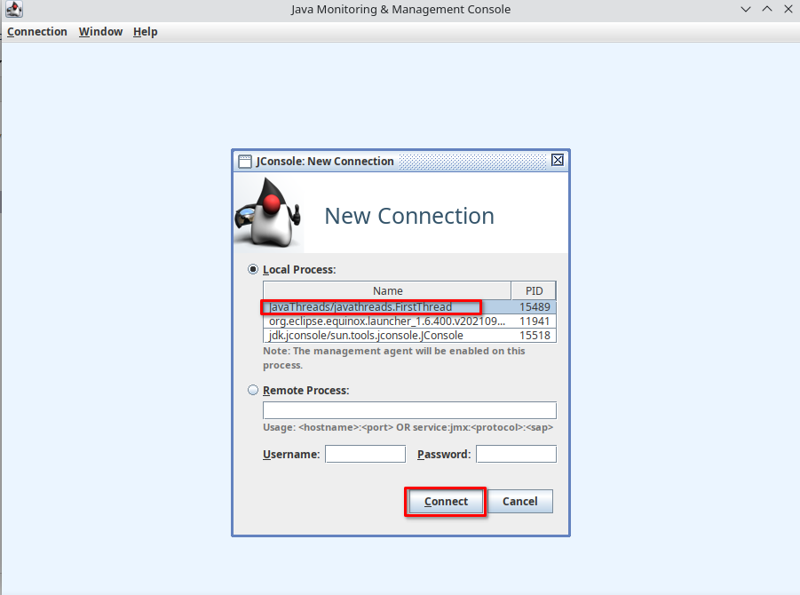
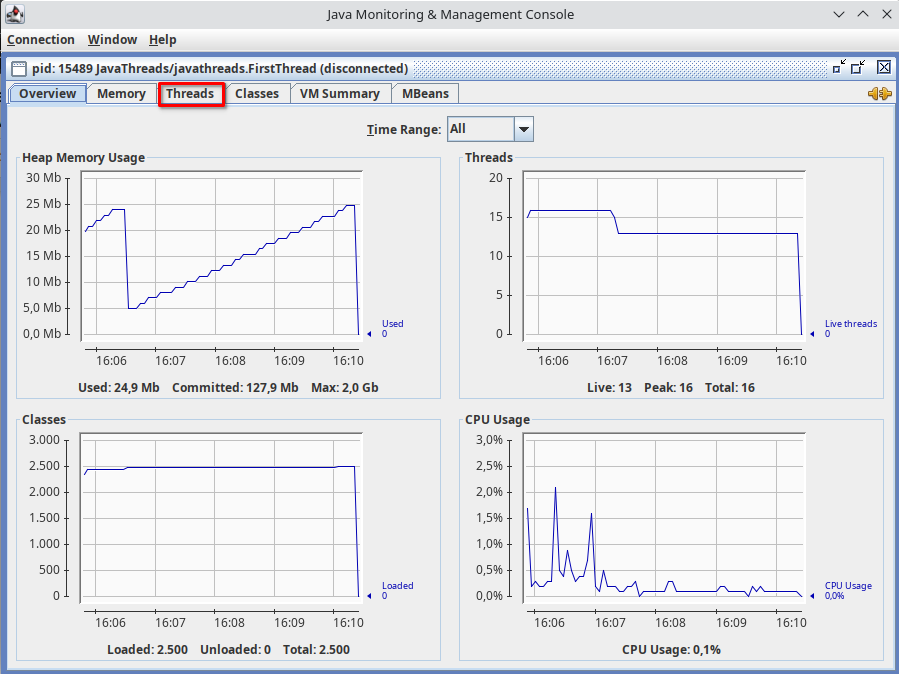
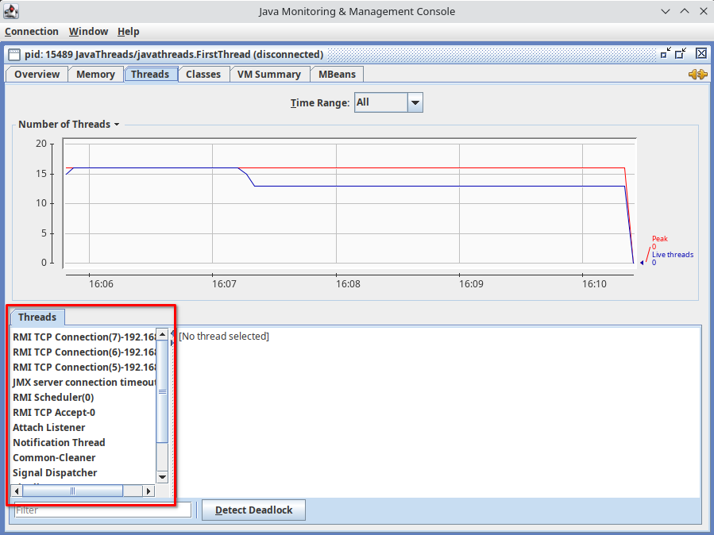
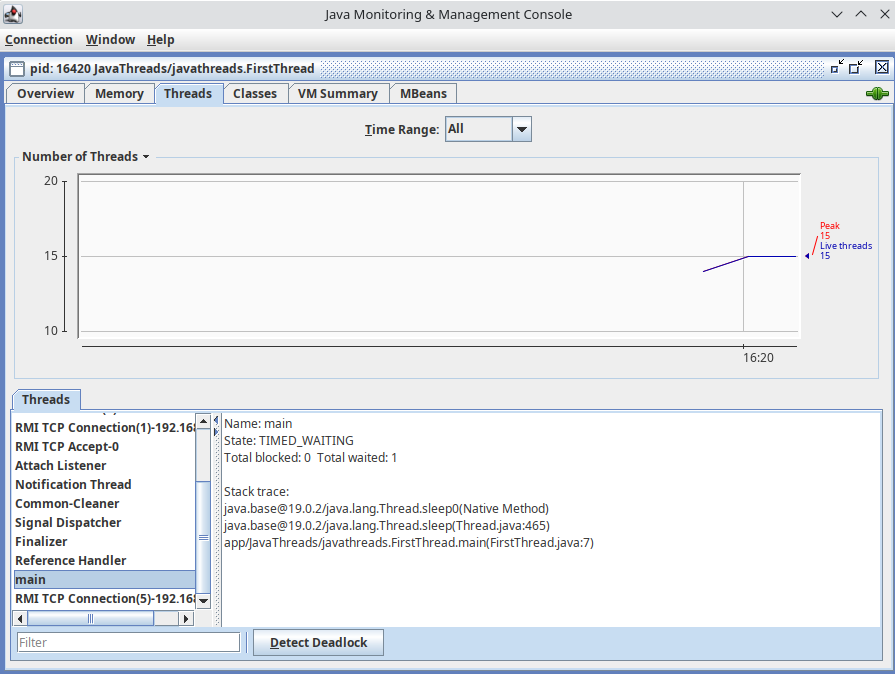

You can use the Thread class to manipulate the current thread.

The sleep method causes the currently executing thread to temporarily cease
execution according to the specified amount of time.

JDK includes a graphical tool for monitoring java local and remote machines that is called jConsole. You can view information about the running threads there. To access it open the terminal application and type the command “jconsole”.

jConsole first page:

Access jConsole while the FristThread project is running on Eclipse.

There is a tab to view information about threads.

Here you can see all current threads.

You can see our main thread.

Create and run a simple java calculator using Java Swing:
package javathreads;

import javax.swing.*;
import java.awt.*;
import java.awt.event.ActionEvent;
import java.awt.event.ActionListener;

public class DivisionWindow {
    private JFrame frame;
    private JLabel num1Label, num2Label, resultLabel;
    private JTextField num1Field, num2Field;
    private JButton divideButton;

    public DivisionWindow() {
        frame = new JFrame("Division Window");
        frame.setSize(400, 200);
        frame.setDefaultCloseOperation(JFrame.EXIT_ON_CLOSE);

        Container container = frame.getContentPane();
        container.setLayout(new GridLayout(4, 2));

        num1Label = new JLabel("Enter Number 1: ");
        num1Field = new JTextField();
        num2Label = new JLabel("Enter Number 2: ");
        num2Field = new JTextField();
        resultLabel = new JLabel();

        divideButton = new JButton("Divide");
        divideButton.addActionListener(new ActionListener() {
            @Override
            public void actionPerformed(ActionEvent e) {
                int num1 = Integer.parseInt(num1Field.getText());
                int num2 = Integer.parseInt(num2Field.getText());
                int result = num1 / num2;
                resultLabel.setText("Result: " + result);
            }
        });

        container.add(num1Label);
        container.add(num1Field);
        container.add(num2Label);
        container.add(num2Field);
        container.add(divideButton);
        container.add(resultLabel);

        frame.setVisible(true);
    }

    public static void main(String[] args) {
        new DivisionWindow();
    }
}

This is a simple calculator that can only divide two numbers. We can increase its performance by delegating each division that is made to a new thread. Create a Thread object, pass the dividing function in its constructor and then call the start() function. 

import javax.swing.*;
import java.awt.*;
import java.awt.event.ActionEvent;
import java.awt.event.ActionListener;

public class DivisionWindow {
    private JFrame frame;
    private JLabel num1Label, num2Label, resultLabel;
    private JTextField num1Field, num2Field;
    private JButton divideButton;

    public DivisionWindow() {
        frame = new JFrame("Division Window");
        frame.setSize(400, 200);
        frame.setDefaultCloseOperation(JFrame.EXIT_ON_CLOSE);

        Container container = frame.getContentPane();
        container.setLayout(new GridLayout(4, 2));

        num1Label = new JLabel("Enter Number 1: ");
        num1Field = new JTextField();
        num2Label = new JLabel("Enter Number 2: ");
        num2Field = new JTextField();
        resultLabel = new JLabel();

        divideButton = new JButton("Divide");
        divideButton.addActionListener(new ActionListener() {
            @Override
            public void actionPerformed(ActionEvent e) {
                Thread divideThread = new Thread(() -> {
                    int num1 = Integer.parseInt(num1Field.getText());
                    int num2 = Integer.parseInt(num2Field.getText());
                    int result = num1 / num2;
                    resultLabel.setText("Result: " + result);
                });
                divideThread.start();
            }
        });

        container.add(num1Label);
        container.add(num1Field);
        container.add(num2Label);
        container.add(num2Field);
        container.add(divideButton);
        container.add(resultLabel);

        frame.setVisible(true);
    }

    public static void main(String[] args) {
        new DivisionWindow();
    }
}

